**Network Design Project -- OSPF WAN Architecture**

**Overview**

This project demonstrates the implementation of a hierarchical OSPF
network design using multiple routers and areas. The network consists
of:

- Head Office router

- Two Data Centre routers

- PetrolSite Area Border Router

- Internal PetrolSite router

OSPF is used as the dynamic routing protocol with Area 0 acting as the
backbone network.

**Network Topology**

The topology includes a backbone WAN network (10.255.255.0/24)
connecting all major routers, with internal networks connected behind
each site router.

**IP Addressing Plan**

  ------------------------------------------------------------
  **Device**    **Interface**   **IP Address**   **Network**
  ------------- --------------- ---------------- -------------
  IR-HO-100     Gi0/0           10.0.15.100      HO LAN

  ABR-DC1-101   Gi0/0           10.1.15.101      DC1 LAN

  ABR-DC2-102   Gi0/0           10.2.15.102      DC2 LAN

  ABR-PET-103   Gi0/3           10.255.255.103   WAN

  IR-PET-301    Gi0/0           10.45.15.201     Internal Link
  ------------------------------------------------------------

**OSPF Design**

The network uses a hierarchical OSPF design:

  ------------------------
  **Area**   **Purpose**
  ---------- -------------
  Area 0     WAN backbone

  Area 1     DC1

  Area 2     DC2

  Area 3     PetrolSite
  ------------------------

The PetrolSite network uses an Area Border Router to connect internal
subnets to the backbone.

The WAN backbone uses OSPF Area 0. Each major remote site is assigned
its own OSPF area to support scalable hierarchical routing design.
ABR-DC1-101 connects Area 1 to Area 0, ABR-DC2-102 connects Area 2 to
Area 0, and PetrolSite connects Area 3 to Area 0. This reduces
unnecessary routing overhead and follows OSPF best practice by keeping
all non-backbone areas attached to Area 0.

A loopback interface was configured on each router to provide a stable
logical address for OSPF router identification. This is preferred over
using physical interfaces because loopback addresses remain available as
long as the router is operational, even if a physical interface fails.

**Technical Tests**

**Interface Configuration Verification**

The command below was used to verify that all router interfaces were
configured correctly.

Output from **ABR-PET-103 (PetrolSite Router)**:

**Command: Show ip interface brief**

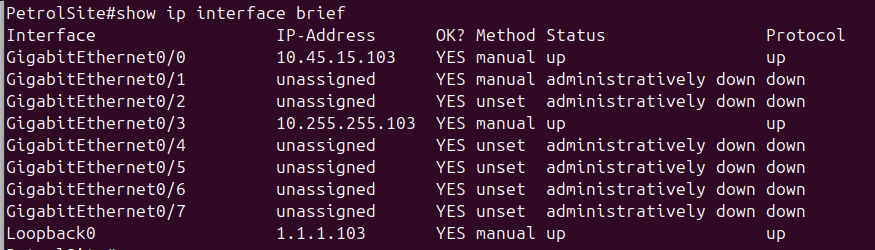{width="6.260416666666667in"
height="1.7916666666666667in"}

- **GigabitEthernet0/0** -- configured with IP address 10.45.15.103 and
  is **up/up**, confirming connectivity to the PetrolSite LAN.

- **GigabitEthernet0/3** -- configured with IP address 10.255.255.103
  and is **up/up**, confirming connectivity to the WAN backbone network.

- **Loopback0** -- configured with IP address 1.1.1.103 and used for
  router identification within OSPF.

- Other interfaces are unused and therefore remain administratively
  down.

- This confirms that the PetrolSite router has both LAN and WAN
  connectivity established.

**Testing WAN Connectivity**

Connectivity between routers on the network was tested using the ping
command

**Output of ABR-PET-103 (PetrolSite) ping to Head Office router**:

**Command: Ping 10.255.255.100**

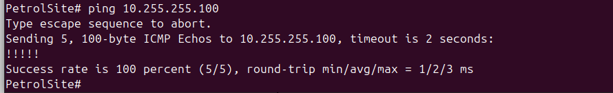{width="6.260416666666667in"
height="0.9479166666666666in"}This confirms successful connectivity
across the WAN

**Verifying OSPF Neighbour Relationships**

The following command was used to confirm that routers formed OSPF
adjacencies.

**Output of ABR-PET-103/ Petrol Site**

**Command: Show ip ospf neighbor**

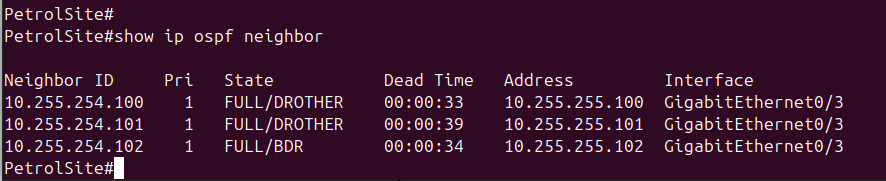{width="6.260416666666667in"
height="1.28125in"}

**Verifying Routing Tables**

Routing tables were inspected to confirm that networks were learned via
OSPF.

**Output of ABR-PET-103/ Petrol Site Command: Show ip route**

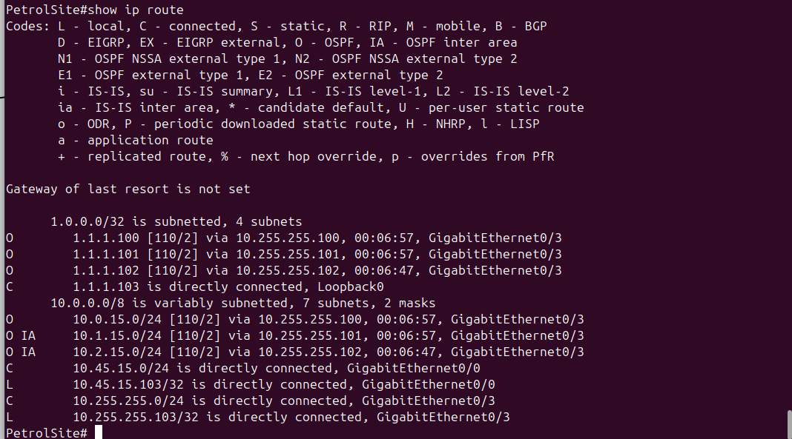{width="6.260416666666667in"
height="3.4791666666666665in"}

- **O** = OSPF route within the same area

- **O IA** = OSPF Inter-Area route

- **C** = Directly connected network

This confirms that routing information is being exchanged correctly
between OSPF areas

**End-to-End Connectivity Test**

End-to-end connectivity between networks was tested using ICMP ping.

**Output of Ping Test from DC1 router to PetrolSite Router**

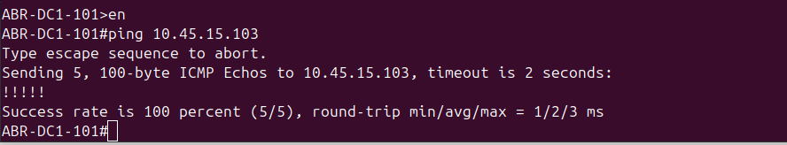{width="6.260416666666667in"
height="1.15625in"}

This test confirms that the PetrolSite LAN gateway (10.45.15.103) is
reachable from other routers on the network. Successful ICMP responses
demonstrate that OSPF routing between the backbone and remote areas is
functioning correctly.

Commands used from **IR-HO-100**

ping 10.1.15.101

ping 10.2.15.102

ping 10.45.15.103

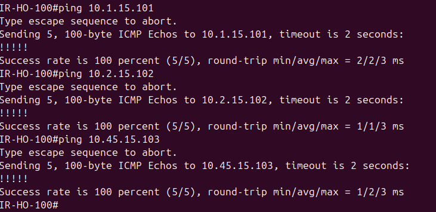{width="5.59375in"
height="2.717762467191601in"}

**From ABR-DC1-101**:

ping 10.0.15.100

ping 10.2.15.102

ping 10.45.15.103

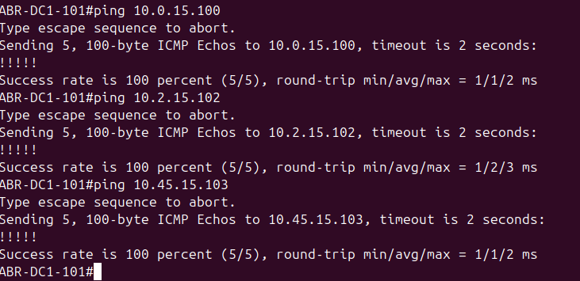{width="5.868465660542432in"
height="2.851234689413823in"}

**From ABR-DC2-102:**

ping 10.0.15.100\
ping 10.1.15.101\
ping 10.45.15.103

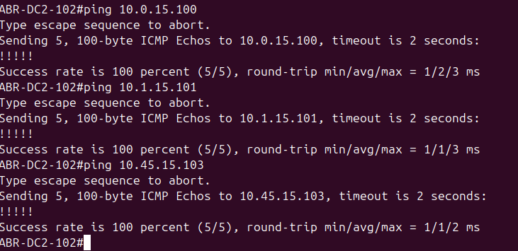{width="5.552083333333333in"
height="2.6975174978127736in"}

This confirms successful inter-area routing between Head Office, DC1,
DC2 and Petrol Site

The PetrolSite was implemented using a hierarchical OSPF design.
ABR-PET-103 connects the PetrolSite to the Area 0 backbone, while
IR-PET-301 provides routing for internal PetrolSite LAN subnets within
Area 3. This mirrors the lecturer example and demonstrates a scalable
multi-area OSPF design.

**Internal Petrol Router Connectivity Test**

**Command Used**

From **ABR-PET-103**:

ping 10.45.15.201

ping 10.45.5.201

ping 10.45.6.201

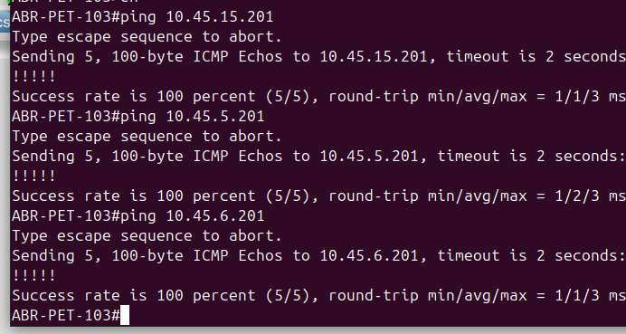{width="6.260416666666667in"
height="3.3333333333333335in"}

Then

From **IR-PET-301:**

**Commands Used:**

ping 10.45.15.103\
ping 10.255.255.100\
ping 10.1.15.101\
ping 10.2.15.102

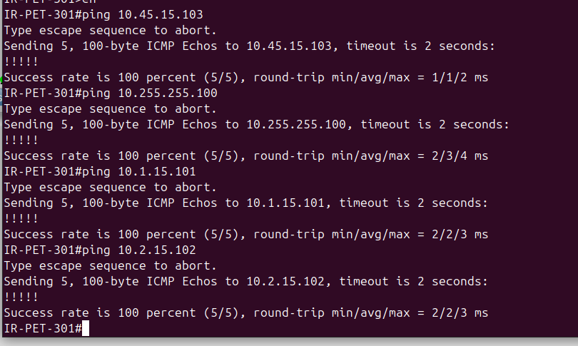{width="6.260416666666667in"
height="3.75in"}

This confirms that the internal Petrol router can communicate with the
PetrolSite ABR and can also reach the wider network through OSPF

**End-to-End Internal Petrol Network Reachability**

This test proves that the internal Petrol subnets are reachable from the
rest of the organisation

**Commands used:**

From **IR-HO-100**:

ping 10.45.5.201

ping 10.45.6.201

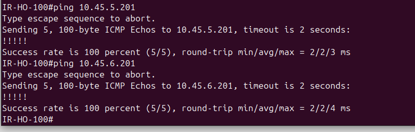{width="6.260416666666667in"
height="2.0in"}

From **ABR-DC1-101**:

ping 10.45.5.201

ping 10.45.6.201

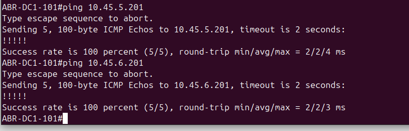{width="6.260416666666667in"
height="2.0in"}

From **ABR-DC2-102**:

ping 10.45.5.201

ping 10.45.6.201

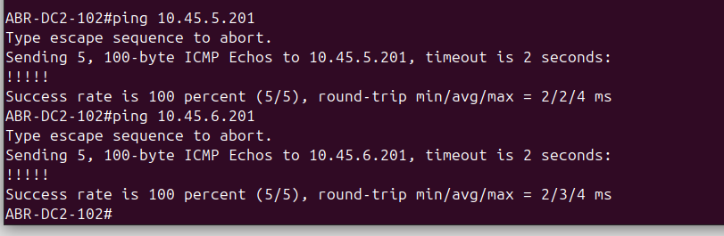{width="6.260416666666667in"
height="2.0416666666666665in"}This confirms that the internal PetrolSite
networks behind IR-PET-301 are fully advertised and reachable from all
remote sites.

**OSPF Database Verification**

The following command was used to verify that OSPF link-state
advertisements were being exchanged correctly.

show ip ospf database on ABR-DC2-102

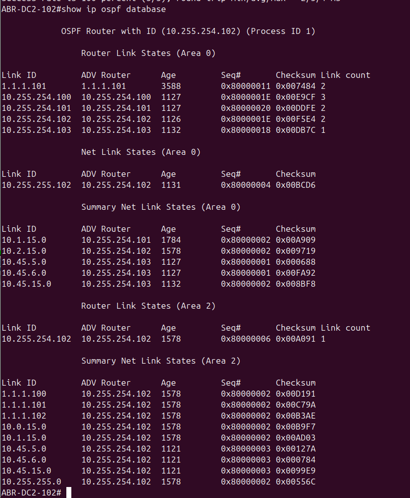{width="5.166666666666667in"
height="6.260416666666667in"}

This test confirms that OSPF is fully functioning beyond basic neighbour
formation and that LSAs are being shared between routers

The technical tests confirmed that all router interfaces were configured
correctly, OSPF neighbour adjacencies formed successfully, routing
tables were populated with remote networks, and end-to-end connectivity
was achieved across all backbone and internal site networks. The
addition of the internal PetrolSite router further demonstrated correct
hierarchical OSPF design, with Area 0 used for the WAN backbone and Area
3 used for the PetrolSite internal routing domain
