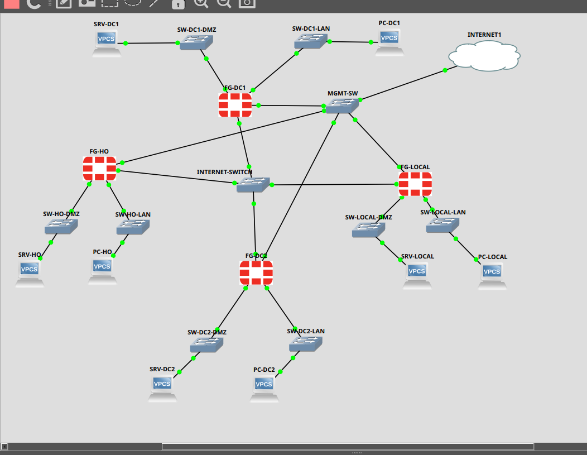
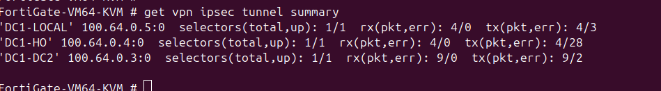
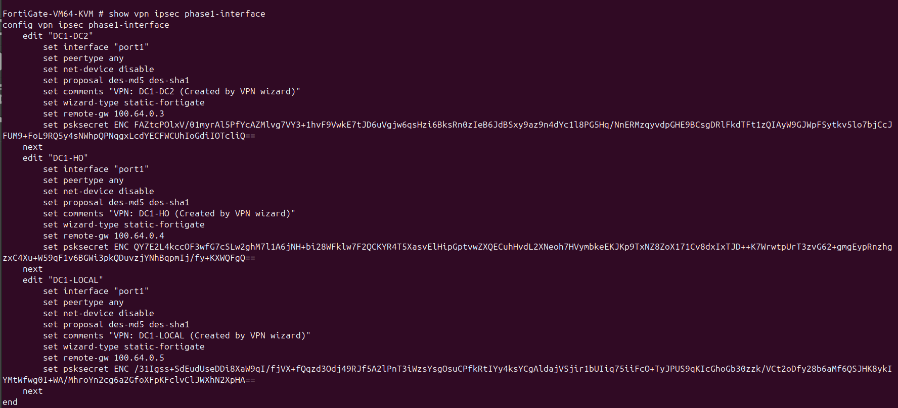
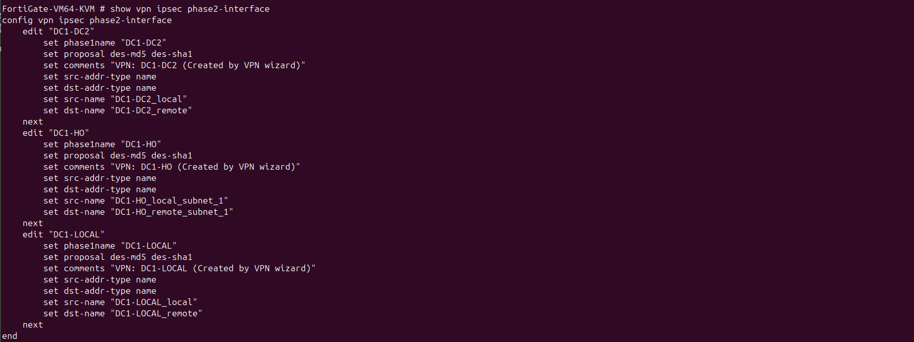
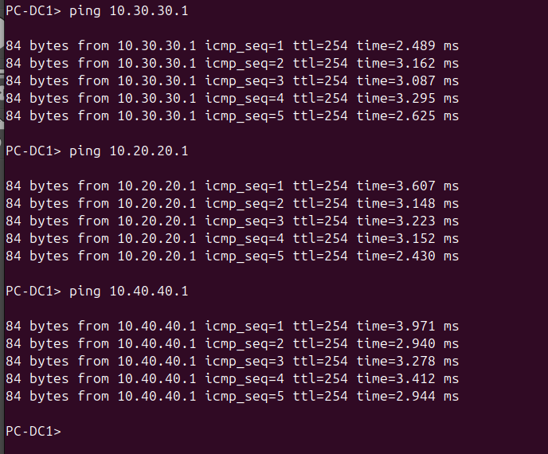
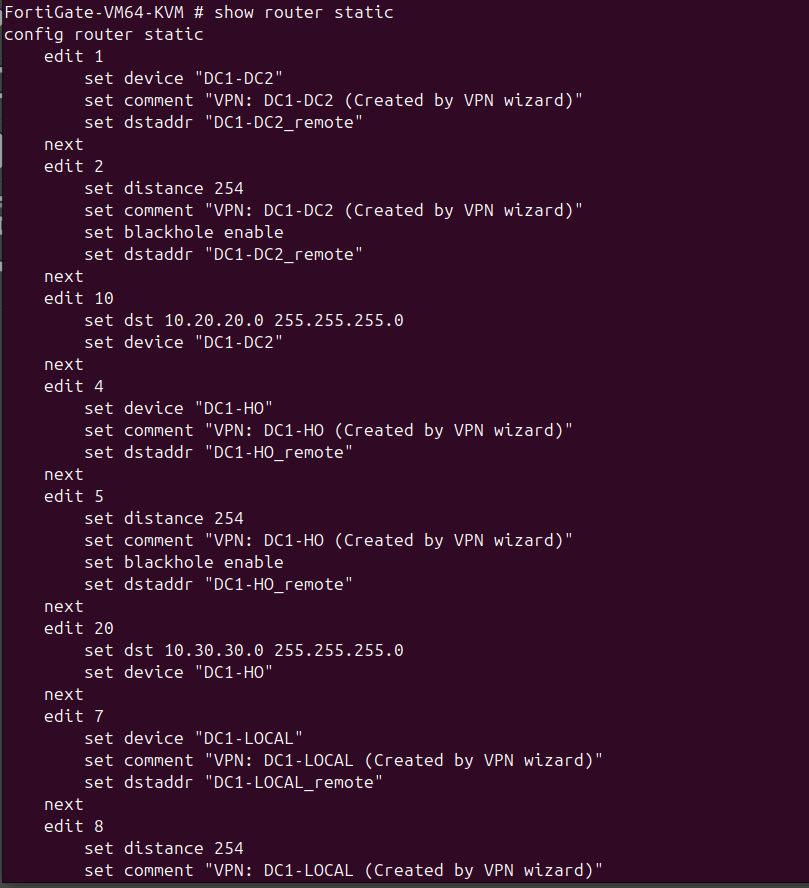
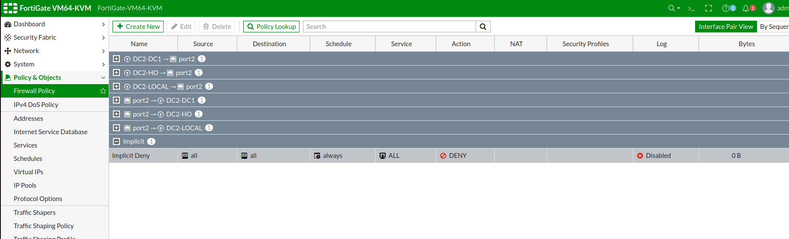

**Assignment 6 Technical notes**

**Network Topology Overview**

{width="6.5in"
height="5.03125in"}

The network topology represents a **centralized WAN architecture**
connecting multiple sites, including **Data Centre 1, Data Centre 2,
Head Office, and a Local Site**, via secure IPsec VPN tunnels.

At the core of the design are the two data centers, which host the main
line-of-business applications. These data centers act as central hubs,
with all other sites connecting to them over encrypted VPN tunnels.

Internet connectivity was provided via the WAN interface (port1),
connected to a shared internet switch within the GNS3 environment.
Firewall policies were configured to allow internal users to access
external networks, simulating real-world internet access from each site.
The architecture is scalable, allowing additional sites or VPN tunnels
to be integrated with minimal changes to the existing design.

Each site is structured with three key network zones:

- **WAN Interface (port1):**\
  Connects each firewall to the internet via a shared internet
  switch/cloud. Public IP addressing (e.g. 100.64.0.0/24) is used to
  simulate external connectivity in GNS3.

- **LAN Interface (port2):**\
  Hosts internal users and devices at each site (e.g. 10.10.10.0/24,
  10.20.20.0/24). This network is protected and only accessible through
  controlled firewall policies.

- **DMZ Interface (port3):**\
  Used for hosting public-facing services such as web servers (e.g.
  172.16.x.0/24). This isolates externally accessible services from the
  internal LAN.

- **Management Interface(port4):**

The management interface is dedicated to administrative access and
monitoring of each FortiGate firewall. In this lab, port4 is connected
to a separate management network (192.168.122.0/24), allowing secure
access via HTTPS, SSH, or console services without interfering with
production traffic.

A dedicated management network was implemented using a central
management switch (MGMT-SW), providing connectivity to the management
interfaces (port4) of all FortiGate firewalls. This management interface
operates on a separate IP range (192.168.122.0/24) and is isolated from
both production of LAN traffic and WAN/VPN traffic. The purpose of this
design is to enable secure administrative access to all firewall devices
via protocols such as HTTPS and SSH without exposing management services
to untrusted networks.

**VPN Architecture**

The VPN architecture implemented in this lab is based on a
**site-to-site IPsec design**, enabling secure communication between
multiple geographically distributed networks (DC1, DC2, Head Office, and
Local site) over an untrusted WAN environment.

Each site is connected via a FortiGate firewall, with VPN tunnels
established across a simulated public network (100.64.0.0/24). The
architecture follows a **partial mesh topology**, where key sites
maintain direct tunnels to one another rather than relying on a single
central hub. This approach improves resilience and reduces dependency on
a single point of failure, ensuring that inter-site communication can
continue even if one tunnel becomes unavailable. Some VPN tunnels
remained inactive until traffic matching the defined selectors was
generated. This reflects standard IPsec behavior, where tunnels are
established dynamically when "interesting traffic" is detected.

**IPsec Tunnel Summary Showing Active Site-to-Site Connectivity**

{width="6.5in"
height="0.8958333333333334in"}

**Phase 1 Configuration for Site-to-Site Tunnel**

{width="6.5in"
height="2.9583333333333335in"}

**Phase 2 Selectors Defining Encrypted Traffic Domains**

{width="6.5in"
height="2.4375in"}

**End-to-End Connectivity Across VPN Tunnel**

{width="6.5in"
height="5.385416666666667in"}

**Routing Configuration**

Routing within the network was implemented using static routes to ensure
that traffic destined for remote site subnets is correctly forwarded
through the appropriate IPsec VPN tunnels. Each FortiGate firewall was
configured with specific routes that associate remote network prefixes
with their corresponding VPN interfaces (e.g. DC1-DC2, DC1-HO,
DC1-LOCAL).

For example, on DC1, routes were defined to direct traffic for the DC2
(10.20.20.0/24), Head Office (10.30.30.0/24), and Local site
(10.40.40.0/24) networks through their respective VPN tunnel interfaces.
This ensures that inter-site traffic is encapsulated within the secure
IPsec tunnels rather than being sent over the default WAN route.

**Static Routing Configuration Directing Traffic Through VPN Tunnels**

{width="5.916666666666667in"
height="6.5in"}

**Firewall Policies**

Firewall policies were implemented on each FortiGate device to control
and permit traffic between internal networks and across VPN tunnels. In
FortiGate environments, traffic is implicitly denied by default;
therefore, explicit policies are required to allow communication between
source and destination networks.

For this lab, policies were configured to allow bidirectional traffic
between local LAN interfaces and IPsec VPN interfaces. This ensures that
traffic originating from internal subnets (e.g. 10.10.10.0/24) can
securely traverse the VPN tunnel to reach remote subnets (e.g.
10.20.20.0/24, 10.30.30.0/24), and vice versa.

Each policy typically included:

- **Incoming interface:** LAN (port2) or VPN interface

- **Outgoing interface:** Corresponding VPN tunnel or LAN

- **Source address:** Local subnet

- **Destination address:** Remote subnet

- **Service:** ALL (for testing purposes)

- **Action:** ACCEPT

- **NAT:** Disabled

**Firewall Policies Enabling Bidirectional VPN Traffic**

{width="6.5in"
height="1.9791666666666667in"}

The screenshot above illustrates the firewall policies configured on the
DC2 FortiGate device. Policies are implemented in both directions,
allowing traffic from the internal LAN (port2) to remote sites via VPN
interfaces, and vice versa. This bidirectional configuration ensures
full communication between sites.

The presence of an implicit deny rule at the bottom reflects a
default-deny security posture, where any traffic not explicitly
permitted is automatically blocked. This aligns with best practices in
network security, ensuring that only authorized traffic is allowed
across the network. Network Address Translation (NAT) was disabled on
VPN-related firewall policies to preserve original source and
destination IP addressing. This is essential for IPsec functionality, as
NAT can interfere with Phase 2 selector matching and prevent successful
tunnel establishment.

**Internet & External Access**

An **i**nternet cloud node is used in GNS3 to simulate real-world
internet connectivity.\
All firewall WAN interfaces connect to a central internet switch, which
then connects to the cloud.

This allows:

- VPN tunnels to form between sites

- External access to DMZ-hosted services

- Simulation of real-world perimeter security

**Security Design**

The topology enforces strong security principles:

- Internal LANs are not directly exposed to the internet

- Public services are isolated in the DMZ

- VPN tunnels encrypt all inter-site traffic

- Firewall policies strictly control allowed traffic flows

This layered approach ensures both connectivity and security, aligning
with best practices for enterprise WAN design.
